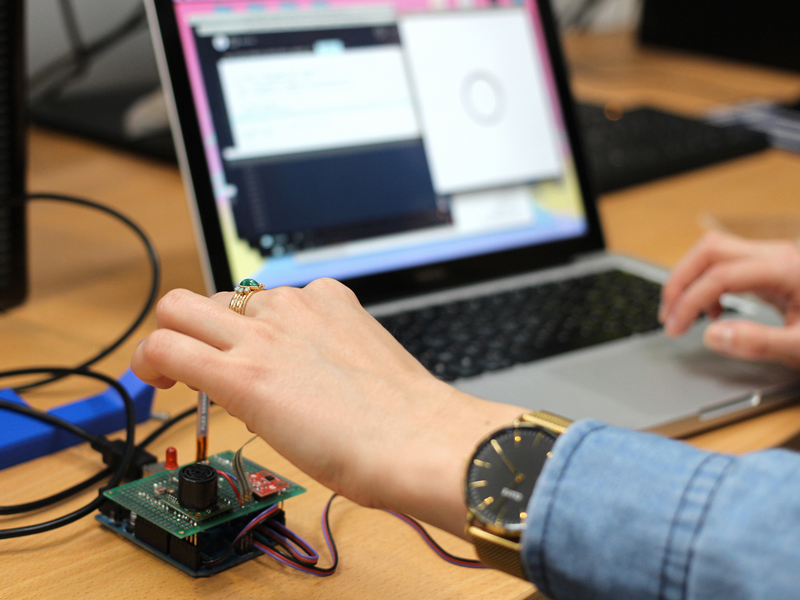

<<<<<<< HEAD
#Workshop Stereo-Signes (alias DataFossil) réalisé à Stereolux les 29, 30 et 31 mars 2016
=======
# Description du workshop Stereo-Signes (alias DataFossil) à Stereolux les 29, 30 et 31 mars 2016
>>>>>>> origin/master

## Sujet :
Créer un objet-signe à la fois réactif (aux capteurs) et apte à se matérialiser physiquement.

## Processus :
- 1/ Concevoir une visualisation réactive aux données des capteurs sous la forme d'un objet graphique, d'un paysage, d'un organisme.
- 2/ Matérialiser cet instant ou cette série d'instants (timeline) sous la forme d'une stratification ou d'un objet sculptural.

Pour atteindre cet objectif, nous avons mis en place et préparé un processus qui réunis :
- un ensemble de capteurs 
- des sketchs Arduino et Processing facilitant la récupération des données, leur visualisation et leur export en format vectoriel.

## Contrainte :
- Le workshop étant d'une durée de 3 jours, il est proposé aux participant de se concentrer dans un premier temps sur des visualisations 2D. Celles-ci pourront ensuite assembler comme un objet en 3 dimensions (strates ou disposition dans l'espace spécifique) lors de leur matérialisation.  
- pour des questions de temps, il est également proposé d'utiliser des procédés de découpe ou gravure laser, plus rapide que les procédés d'impression 3D, même si ces derniers ne sont pas exclus.

## Références :
- [Dataphys.org](http://dataphys.org/list/)
- [Exemple D3js](https://github.com/mbostock/d3/wiki/Gallery)
- [Meshu](https://meshu.io/make/facet)
- [n-e-r-v-o-u-s.com](http://n-e-r-v-o-u-s.com)
- [Petroglyphe](https://fr.wikipedia.org/wiki/P%C3%A9troglyphe)

<<<<<<< HEAD
##Planning :
###Jour 1 - matin :
=======

## Planning :
### Jour 1 - matin :
>>>>>>> origin/master
- présentation du studio Chevalvert et du thème du workshop
- découverte et test des sketchs et du processus mis à disposition

### Jour 1 - après-midi :
- suite découverte et test des skecths mis à disposition
- formation possible de groupe (par 2 ou 3)
- recherche sur la visualisation et les exports

### Jour 2 - matin :
- découverte du FabLab et formation sur les machines
- premier tests d'impression
- en parallèle, recherche sur la visualisation et les exports

### Jour 2 - après-midi :
- optimisation de la la visualisation et des exports
- exports en série et tests de gravure et/ou de découpe

### Jour 3 - matin :
- gravure et/ou découpe des exports optimisés

### Jour 3 - après-midi :
- gravure et/ou découpe des exports optimisés
- montage des objets-signes
- documentation photo/vidéo et échanges

<<<<<<< HEAD
##Les librairies utilisées sont :
###• Pour Arduino :
=======

## Les librairies utilisées sont :
### • Pour Arduino :
>>>>>>> origin/master
- la lib [SensorSieldlib](https://github.com/MAKIO135/sensorShieldLib) Lionel Radisson qui facilite la récupération des données des capteurs
- la lib [SparkFun_HTU21D](https://github.com/sparkfun/HTU21D_Breakout) pour le capteur d'humidité (permettant aussi de récupérer la chaleur)
- la lib SparkFun [SFE_MMA8452Q](https://github.com/sparkfun/MMA8452_Accelerometer) pour le capteur accéléromètre

### • Pour Processing (requis pour les participants) :
- la lib [oscP5](https://github.com/sojamo/oscp5) pour la transmission de données sur un réseau à partir d'un ordinateur (serveur) à un ou plusieurs ordinateurs (client)
- la lib [controlP5](https://github.com/sojamo/controlp5) pour le contrôle de paramètre via une interface utilisateur graphique (GUI)

<<<<<<< HEAD
##Contenu du dossier :
=======
## Contenu du dossier :

>>>>>>> origin/master
----
# Description des sketchs

## 00-SENSOR-GROUP-BASE
### a00_SENSOR-SHIELD
Sketch Arduino permettant le fonctionnement des capteurs

Capteurs utilisés :
- capteurLDR	Lumière 
- capteurFSR	Force (pression)
- capteurFLEX	Flexion
- capteurPOULS	Pouls
- capteurSONAR	Distance

### p00_arduino_to_processing
Sketch Processing permettant la communication entre Arduino et Processing.
Une fonction Datavis permet le contrôle du "mapping" des données et de leur affichage en temps-réel.

<<<<<<< HEAD
##10-MULTICAST
=======

## 10-MULTICAST
>>>>>>> origin/master

### p00_oscP5_multicast_server
Ce sketch utilise la librairie oscP5 pour envoyer les données "parsée" au format JSON des capteurs sur une adresse IP (224.0.0.1 par exemple) via un réseau (WiFi ou ethernet).

### p10_oscP5_multicast_client
Une fois le sketch "server" lancé (p00_oscP5_multicast_server), ce sketch "client" permet la réception des données, leur visualisation et l'export de celle-ci en format vectoriel sous PDF (touche "f" comme Frame pour l'export).

### p20_oscP5_multicast_client_controlP5
Ce sketch est une variante du sketch précédent "client" où la librairie controlP5 a été ajouté pour justement contrôler le rendu de la visualisation.

<<<<<<< HEAD
##20-DRAW-RADIAL
=======

## 20-DRAW-RADIAL
>>>>>>> origin/master

### p00_client_datavis_radial_lines
Visualisation circulaire itérative sous la forme de cercles concentriques. Un export PDF est généré automatiquement quand le cercle a fait un tour complet, soit 360°.  

<<<<<<< HEAD
##30-DRAW-STRATES
=======

## 30-DRAW-STRATES
>>>>>>> origin/master

### p00_client_datavis_strates_degrees
Visualisation itérative sous la forme de barres de même longueur. La seule information est basée sur le capteur de flexion et transforme les données en degrés. Cette information permettra après découpe de faire varier l'angle des barres suivant la flexion appliquées à chaque enregistré.

### p10_client_datavis_strates_vertex
Visualisation continue sous la forme de vertex basée sur le capteur de flexion.
La touche "f" permet de sauvegarder une frame au cours du processus.

### p15_client_datavis_strates_vertex_multiple
Visualisation identique à p10_client_datavis_strates_vertex mais qui combine 4 capteurs. 

### p20_client_datavis_strates_lines
Visualisation itérative sous la forme de strates composées de lignes. La hauteur de celles-ci varient suivant les valeurs réceptionnées.

<<<<<<< HEAD
##30-SAVE-VALUES
=======

## 30-SAVE-VALUES
>>>>>>> origin/master

### p00_print_writer_base
Exemple pour la captation d'une variable (position souris X et Y) et l'enregistrement dans un fichier au format .txt. 

### p25_print_writer_from_arduino
Exemple pour la captation des données de capteurs depuis Arduino et leur enregistrement dans un fichier au format .txt. 

### p30_load_print_writer
Exemple pour le chargement des données depuis un fichier .txt et leur visualisation immédiate. 

### p40_load_print_writer_one_by_one
Exemple pour le chargement des données depuis un fichier .txt et leur visualisation itérative.

### p50_oscP5_multicast_server_print_writer
Intégration de l'enregistrement de données au sein d'un sketch "server".

### p60_oscP5_multicast_client_print_writer
Intégration de l'enregistrement de données au sein d'un sketch "client".

#Réalisations

##Participants
Clément Gault, Louis Éveillard, Émilie Coquard, Nathalie Guimbretiere, Estelle Hary, Gaëlle Jolivet, Andréa Dumont, Adam Duwyn, Estelle Joly, Anaëlle Couëllan, Delphine Kreis

